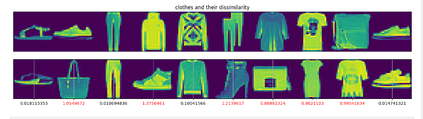
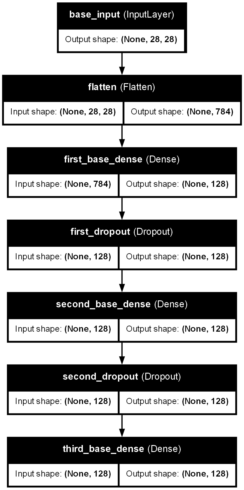
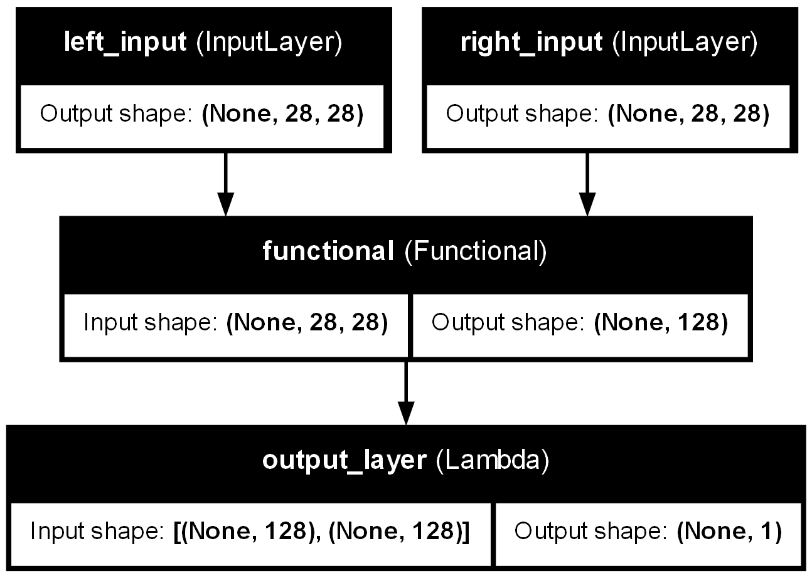

# Siamese Network with Fashion MNIST and Euclidean Distance


This repository implements a **Siamese Network** on the **Fashion MNIST** dataset. The network is trained to determine whether two input images belong to the same class by calculating their **Euclidean distance** in feature space.

## Table of Contents

- [Introduction](#introduction)
- [Architecture](#architecture)
- [Dataset](#dataset)
- [Training](#training)
- [Evaluation](#evaluation)
- [Visualizations](#visualizations)
- [How to Run](#how-to-run)
- [References](#references)

## Introduction

Siamese Networks are a type of neural network architecture that learns to differentiate between two inputs by measuring the similarity between them. In this project, we use **Fashion MNIST** images as input and calculate their **Euclidean distance** in feature space to classify pairs as either similar or dissimilar.

## Architecture

The architecture of the Siamese Network consists of two identical sub-networks that extract feature vectors from the input images. The Euclidean distance between these vectors is computed, and a binary classifier is used to predict whether the inputs are from the same class or different classes.

## Dataset

We use the **Fashion MNIST** dataset, which contains grayscale images of 28x28 pixels across 10 fashion categories.

## Training

The network is trained to minimize the contrastive loss, which penalizes dissimilar pairs that are classified as similar and vice versa.

## Evaluation

During evaluation, pairs of test images are passed through the network, and their similarity is determined based on the Euclidean distance between their feature vectors.

## Visualizations

Below are some visualizations from the model Architecture.

### Base Model


### Outer-model


## How to Run

1. Clone the repository:
    ```bash
    github.com/ahmad786writes/Siamese-Network
    ```
2. Install the Tensorflow 
3. Run the Notebook

## References

- [Siamese Neural Networks for One-shot Image Recognition](https://www.cs.cmu.edu/~rsalakhu/papers/oneshot1.pdf)
- [Fashion MNIST Dataset](https://github.com/zalandoresearch/fashion-mnist)
